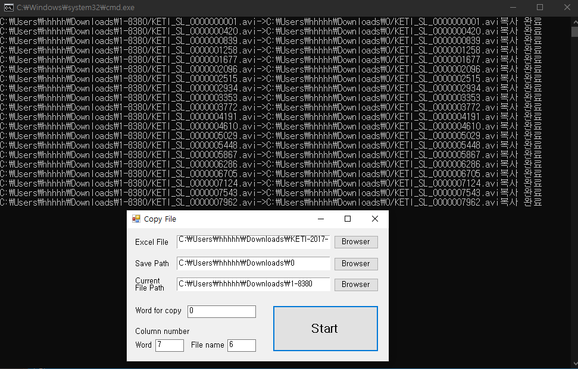

### excel 파일을 이용한 특정 파일을 복사
  

  
### 사용법 
1. excel 파일을 불러옵니다.
2. save path : 복사 파일을 저장할 위치를 지정합니다.
3. current path(현재 파일이 있는 디렉토리)를 지정합니다.
4. Word for copy : 복사할 특정 단어를 입력합니다.
5. Column number Word : 해당 단어가 있는 열의 번호를 입력합니다.
6. Column number File name : 파일 이름이 들어있는 열의 번호를 입력합니다.
7. Start 버튼을 클릭합니다.
  
### 주의사항
excel 파일에 "복사할 파일 이름.확장자"가 저장된 열이 있어야 합니다.  
지정한 현재 파일의 디렉토리만 탐색하고 자식의 디렉토리는 탐색하지 않습니다.
  
### 실행 파일 다운로드
<a href="https://github.com/Hoil2/CopyFileFromExcel/raw/main/CopyFileFromExcel.exe">CopyFileFromExcel.exe</a>
